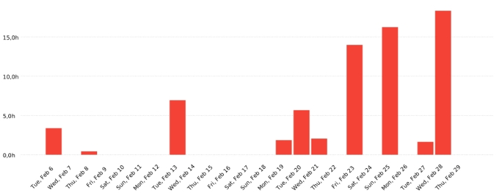

Summary report 

06/02/2024 - 29/02/2024 

Total: 70:32:36      Billable: 70:32:36      Amount:  0,00USD 

User![ref1]

PSG2       Created with Clockify       1

Description![ref1]

 Tomhuecal 08:37:35 12,23%

|Serponlop|14:53:07|21,10|
| - | - | - |
|Pabcascom|16:40:39|23,64|
|Natalia Olmo Villegas|14:17:15|20,25|
|Fradelure|16:04:00|22,78|

 informe tecnico 01:33:29 2,21%

|correcciones technical report|02:09:00|3,05|
| - | - | - |
|sprint planning|00:15:00|0,35|
|ITop Configuration|05:06:05|7,23|
|info en el pom|00:11:00|0,26|
|añadir al itop especificaciones del equipo|00:09:00|0,21|
|añadir al informe de IA tus problemas|01:06:00|1,56|
|revisiones finales|02:20:00|3,31|

PSG2       Created with Clockify       

 (Without Description) 49:25:11 70,06%

|IA Report|00:13:41|0,32|
| - | - | - |
|tarea 1.6 ) a|03:34:00|5,06|
|Sprint retrospective|02:03:00|2,91|
|revision general informes|01:08:06|1,61|
|Sprint Retrospective|00:48:26|1,14|
|change colours of bottons in the list of pets|00:30:38|0,72|

User / Description Duration Amount

|Tomhuecal|08:37:35|0,00 USD|
| - | - | - |
|info en el pom|00:11:00|0\.00 USD|
|añadir al itop especificaciones del equipo|00:09:00|0\.00 USD|
|añadir al informe de IA tus problemas|01:06:00|0\.00 USD|
|informe tecnico|01:03:57|0\.00 USD|
|tarea 1.6 ) a|03:34:00|0\.00 USD|
|Sprint retrospective|02:03:00|0\.00 USD|
|change colours of bottons in the list of pets|00:30:38|0\.00 USD|
|Serponlop|14:53:07|0,00 USD|
|(Without Description)|14:53:07|0\.00 USD|
|Pabcascom|16:40:39|0,00 USD|
|(Without Description)|16:40:39|0\.00 USD|
|Natalia Olmo Villegas|14:17:15|0,00 USD|
|(Without Description)|14:17:15|0\.00 USD|
|Fradelure|16:04:00|0,00 USD|

informe tecnico 00:29:32 0.00 USD

|correcciones technical report|02:09:00|0\.00 USD|
| - | - | - |
|sprint planning|00:15:00|0\.00 USD|
|ITop Configuration|05:06:05|0\.00 USD|
|revisiones finales|02:20:00|0\.00 USD|
|(Without Description)|03:34:10|0\.00 USD|
|IA Report|00:13:41|0\.00 USD|
|revision general informes|01:08:06|0\.00 USD|

Sprint Retrospective 00:48:26 0.00 USD
PSG2       Created with Clockify       3

[ref1]: Aspose.Words.96cbb631-dfbb-44f1-8550-7dab502d6ea4.003.png
