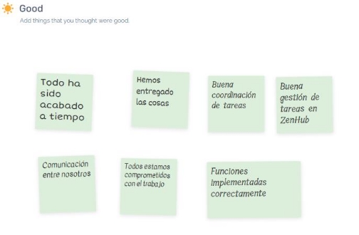

*https://github.com/gii-is-psg2/psg2-2324-g7-71*

**Sprint retrospective**

**INTEGRANTES DEL GRUPO G7-71:** 

- Franco Dell ’Águila Ureña [(fradelure@alum.us.es)](mailto:fradelure@alum.us.es) 
- Tomás Huecas Calderón [(tomhuecal@alum.us.es)](mailto:tomhuecal@alum.us.es) 
- Pablo Jesús Castellanos Compaña[(pabcascom@alum.us.es)](mailto:pabcascom@alum.us.es) 
- Sergio Pons López [(serponlop@alum.us.es)](mailto:serponlop@alum.us.es) 
- Natalia Olmo Villegas [(natolmvil@alum.us.es)](mailto:natolmvil@alum.us.es) 

**FECHA:** Sevilla, 28 de febrero 2024 

`  `ÍNDICE 

1. [Acta de reunión ](#_page2_x69.00_y76.00)

2. [Introducción  ](#_page2_x69.00_y273.00)

3. [Éxito y Puntos Destacados ](#_page2_x69.00_y401.00)

4. [Desafíos y Obstáculos  ](#_page3_x69.00_y76.00)

5. [Puntos a mejorar  ](#_page4_x69.00_y76.00)

6. [Acciones de Mejora  ](#_page5_x69.00_y76.00)

7. [Evaluación del equipo ](#_page6_x69.00_y76.00)

8. [Comprobación del cumplimiento de las prácticas del equipo](#_page6_x69.00_y622.00)

   8.1 [TP1: Cada miembro del equipo debería trabajar solo en una historia de usuario/tarea al mismo tiempo ](#_page6_x69.00_y686.00)

   8.2 [TP2: Cada miembro del equipo debe finalizar al menos una historia de usuario/tarea a la semana 8 ](#_page7_x69.00_y135.00)

   8.3 [TP3: Crear una rama asociada justo después de que la tarea haya sido movida a la columna “In Progress” incluyendo el número de tarea como “/#” al final del nombre de la rama (ej: “CrearPet/41”) ](#_page7_x69.00_y250.00)

   8.4 [TP4: Cada miembro del equipo debe hacer comentarios en pull requests que no hayan sido creadas por él, incluyendo revisiones positivos y propuestas de cambios ](#_page7_x69.00_y422.00)

9. [Conclusiones ](#_page7_x69.00_y609.00)

## 1. Acta de reunión

Fecha: 28 de febrero de 2024 Hora: 11:00 – 11:40 Participantes:  

- Franco Dell ’Águila Ureña 
- Tomás Huecas Calderón  
- Pablo Jesús Castellanos Compaña 
- Sergio Pons López  
- Natalia Olmo Villegas  

## 2. Introducción

En este documento se recoge lo que el equipo de trabajo ha realizado durante este Sprint, tanto las cosas que se han realizado correctamente como las cosas que se han hecho mal y las posibles mejoras a introducir en los próximos Sprints, con el objetivo de aprender y reducir los errores y así aumentar la productividad y la calidad del trabajo. 

## 3. Éxito y Puntos Destacados

Como grupo, hemos sabido trabajar bien entre nosotros y tras un proceso de aprender a utilizar las nuevas herramientas como ZenHub hemos hecho una buena gestión de estas. Hemos utilizado Epics, a pesar de que el Product Owner advirtiera que no eran necesarias en esta entrega y hemos estimado los tiempos de cada tarea mediante planning poker.  

## 4. Desafíos y Obstáculos

Hemos destacado que uno de nuestros principales problemas ha sido la falta de coordinación en el formato de los documentos, pues a pesar de que disponíamos de una plantilla común para realizar los informes, a veces no se utilizaba el mismo tipo de letra o no se justificaba el texto, por lo que deberíamos determinar un tipo de letra estándar, sangría, estilo y justificado.  

Tras la revisión del Product Owner, hemos comprobado que no hemos puesto los ejemplos necesarios reflejados en nuestro trabajo de lo que estábamos realizando, luego es algo que deberemos corregir.  

Por último, tras no leer con detenimiento todas las presentaciones de laboratorio, no nos dimos cuenta de que debíamos seguir la metodología GitFlow, por tanto, la seguiremos en los próximos Spints. 

## 5. Puntos a mejorar

Tras lo comentado anteriormente hemos determinado que deberíamos leer con más detenimiento las transparencias de clase, trabajar más en equipo, es decir repartir las tareas para que se realicen entre más personas del equipo en vez de individualmente, para que el trabajo sea más dinámico. 

Además, aplicar la política de commits, que en algunos casos se nos olvidó por no estar acostumbrados a ello. 

Por último, realizar más reuniones, ya que hemos estado trabajando en ocasiones cada uno por su cuenta y creemos que sacaríamos más rendimiento si trabajamos todos juntos a la vez.  

## 6. Acciones de mejora

Por lo tanto, tras esta reunión de retrospectiva, hemos determinado que las acciones a aplicar para conseguir un mejor rendimiento en los siguientes Sprints serán aplicar GitFlow tal y como nos han indicado en clase, agregar mejor los tiempos de Clockify, es decir, acordarnos de poner Clockify al inicio de una tarea; realizar más reuniones, agregar ejemplos de nuestro trabajo a los documentos y preparar el formato de los documentos previamente. Al mismo tiempo, debemos parar de hacer merges sin revisar, tal y como hacíamos al principio del Sprint.  

## 7. Evaluación del equipo

El miembro de la fila valora al miembro de la columna.

|**Miembros del equipo** |Franco Dell ’Águila Ureña |Tomás Huecas Calderón |Pablo Jesús Castellanos Compaña |Sergio  Pons López |Natalia  Olmo Villegas |
| - | :- | :- | - | :- | :- |
|Franco Dell ’Águila Ureña |X |1 |1 |1 |1 |
|Tomás Huecas Calderón |1 |X |1 |1 |1 |
|Pablo  Jesús  Castellanos Compaña |1 |1 |X |1 |1 |
|Sergio Pons López |1 |1 |1 |X |1 |
|Natalia Olmo Villegas |1 |1 |1 |1 |X |
|**TOTAL:**  |**4** |**4** |**4** |**4** |**4** |

Nota acotada entre [0, 4] 

Tras seguir la metodología indicada por el Product Owner y discutir sobre las puntuaciones que han sido repartidas a cada miembro del equipo de desarrollo Scrum, hemos decidido por unanimidad que todos deberíamos recibir la misma puntuación, pues el esfuerzo y trabajo de todos ha estado más o menos  equilibrado  y  todos  los  integrantes  del  grupo  han  estado  implicados  con  el  proyecto  e intentando hacerlo lo mejor posible, aunque hayan surgido algunas pequeñas dificultades debido a que nunca antes habíamos trabajado con estas herramientas.  

## 8. Comprobación del cumplimiento de las prácticas del equipo 

   

   ### TP1: Cada miembro del equipo debería trabajar solo en una historia de usuario/tarea al mismo tiempo 

   Esta práctica se ha cumplido en la mayoría de los casos. Sin embargo, había momentos en los que era necesaria la finalización de otra tarea que estaba realizando otro compañero para poder continuar. En estas ocasiones, para aprovechar el tiempo se le ha asignado 2 tareas al mismo tiempo a la misma persona.  

   

   ### TP2: Cada miembro del equipo debe finalizar al menos una historia de usuario/tarea a la semana 
   
   Hemos cumplido con éxito esta práctica, pues tras reunirnos en cada daily scrum hemos comprobado que todos los integrantes del grupo habían cumplido con todo el trabajo que les había sido asignado.  

   

   ### TP3: Crear una rama asociada justo después de que la tarea haya sido movida a la columna “In Progress” incluyendo el número de tarea como “/#” al final del nombre de la rama (ej: “CrearPet/41”)

   Se ha creado una rama asociada a cada una de las tareas que debían ser implementadas. No obstante, no  se  ha  seguido  la  buena  práctica  de  asignarles  el  nombre  con  la  estructura  que  se  indica,  lo tendremos en cuenta para el siguiente Sprint.  

   

   ### TP4: Cada miembro del equipo debe hacer comentarios en pull requests  que  no  hayan  sido  creadas  por  él,  incluyendo revisiones positivos y propuestas de cambios

   Al principio, hicimos las revisiones sin especificar comentarios en los pull requests, simplemente le comentábamos a nuestro compañero personalmente nuestra opinión y le dejábamos claro los puntos a mejorar. Finalmente, hicimos algunos comentarios de pull request en los últimos commits. Es algo que tendremos en cuenta para el siguiente Sprint.  

## 9. Conclusiones

Este sprint ha servido para tomar contacto con el grupo y con las herramientas de la asignatura. Hemos realizado  cosas  bien,  mientras  que  hay  bastantes  a  mejorar,  para  ello  tomaremos  las  acciones correspondientes y progresaremos para alcanzar las expectativas que tenemos como equipo lograr los objetivos. 
