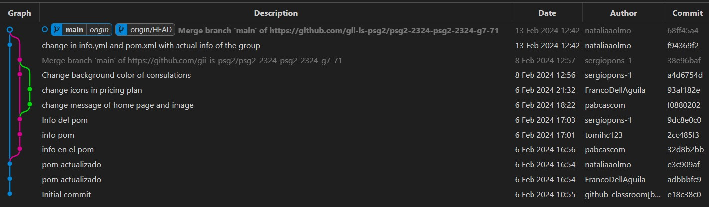

## **Informe técnico del historial del proyecto**

 ### Portada

 
 
**Integrantes del grupo G7-71:**

- Franco Dell ’Águila Ureña (<fradelure@alum.us.es>)
- Tomás Huecas Calderón (<tomhuecal@alum.us.es>)
- Pablo Jesús Castellanos Compaña(<pabcascom@alum.us.es>)
- Sergio Pons López (<serponlop@alum.us.es>)
- Natalia Olmo Villegas (<natolmvil@alum.us.es>)

 ## ÍNDICE

1. [Introducción](#id3)
2. [Commit flow](#id0)
3. [Problemas](#id1)
4. [Conclusiones](#id2)

## Historial de versiones

| **Fecha**      | **Versión** | **Asignados** |
|------------|---------|-----------------------|
| 13/02/2024 | 1.0 | Pablo Jesús Castellanos Compaña, Sergio Pons López |
| 23/02/2024 | 1.1 | Pablo Jesús Castellanos Compaña, Sergio Pons López |
| 25/02/2024 | 1.2 | Pablo Jesús Castellanos Compaña, Sergio Pons López |

### 1. *Introducción*

En este documento vamos a recopilar el historial de versiones del proyecto, para ello usaremos la extensión git Graph de visualStudio, que nos muestra cómo se han ido sucediendo los commits.
 

### 2. *Commit flow*
 

### 3. *Problemas*

Se realizaron dos commits sin haber sincronizado la rama main previamente, provocando la desactualización de la misma.

*Solución al problema:* hacer un merge para sincronizar la rama junto al commit realizado y así actualizarlo todo.

### 4. *Conclusiones*
Al no haber realizado muchos commits de momento, no han surgido muchos errores.
